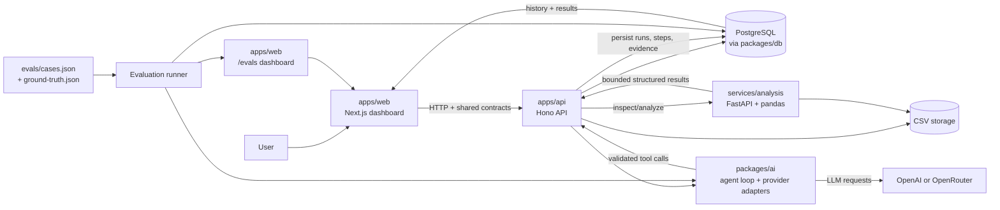

# SignalStack

SignalStack is a production-style foundation for an AI analytics workspace. Users organize work into projects, upload CSV datasets, and ask an AI agent questions answered with reproducible, structured data-analysis steps.

## Repository layout

```text
apps/
  web/                 Next.js dashboard and upload experience
  api/                 TypeScript HTTP API (Hono)
packages/
  db/                  Prisma schema and database client boundary
  schemas/             Shared Zod request/response contracts
  ai/                  ORM-agnostic agent interfaces
evals/                 Curated evaluation cases and generated ground truth
services/
  analysis/            FastAPI service boundary for Python data tools
```

Document-export artifacts are not part of SignalStack. The local `/bridge/` directory is ignored by Git so personal documents produced by external tooling cannot be accidentally committed or uploaded.

### Architecture

- `apps/web` owns presentation, navigation, and browser interactions. It consumes shared contracts rather than importing database code.
- `apps/api` owns HTTP routing and application orchestration. Legacy list/CRUD routes remain lightweight in-memory placeholders, while dataset upload and agent runs use the Prisma boundary for durable records.
- `packages/db` is the only package that knows about Prisma and PostgreSQL. Prisma migrations and generated client output belong here.
- `packages/schemas` is the contract layer shared by the web and API. It keeps validation and serialized shapes aligned.
- `packages/ai` owns the bounded multi-tool agent loop, provider adapter, dataset tools, and grounded chart tool. It has no UI concerns and does not expose hidden model reasoning.
- `services/analysis` is intentionally separate from the TypeScript runtime. It owns pandas-backed dataset inspection and constrained analytical operations.



The normal request path runs from the browser through the API and agent loop, with the Python service performing bounded pandas operations against stored CSV files. Structured results and every visible agent step are persisted in PostgreSQL before the UI renders the answer, evidence, charts, or run history. The evaluation runner reuses the same agent loop and stores its local scores alongside the production-style run records.

## Local setup

Prerequisites: Node.js 22+, pnpm 11+, Python 3.11+, and PostgreSQL 15+.

```bash
pnpm install
cp .env.example .env

# Generate Prisma Client and apply the first migration after PostgreSQL is running.
pnpm --filter @signalstack/db db:generate
pnpm --filter @signalstack/db db:migrate

# Start the web app, API, and Python service in separate terminals.
pnpm --filter @signalstack/web dev
pnpm --filter @signalstack/api dev
cd services/analysis && python -m venv .venv && source .venv/bin/activate
pip install -e '.[test]' && uvicorn app.main:app --reload --port 8000
```

The dashboard is available at `http://localhost:3000`, the API at `http://localhost:4000`, and the analysis service at `http://localhost:8000`.

After the one-time setup, you can start all development services from the repository root with:

```bash
pnpm dev
```

The API loads the workspace `.env` automatically during local development. The web app defaults to `http://localhost:4000`; if the API runs elsewhere, set `NEXT_PUBLIC_API_URL` in `apps/web/.env.local`.

For agent runs, set `AI_PROVIDER` to `openai` or `openrouter`, set `AI_MODEL` to the provider's model ID, and set the matching `OPENAI_API_KEY` or `OPENROUTER_API_KEY` in `.env`. The provider adapters are isolated in `packages/ai/src/providers/`; no provider or model name is hardcoded in the UI. OpenRouter model IDs use the format expected by OpenRouter, such as `openai/gpt-4o-mini`. Both providers use normal JSON responses rather than streaming so the tool-calling loop and persistence are easy to verify end to end.

An LLM provider key is not required for CSV upload or pandas inspection. It is required for “Ask your data” and real-provider evaluations.

Useful workspace commands:

```bash
pnpm typecheck
pnpm build
pnpm lint
pnpm test
```

## Upload and inspection data flow

1. The web upload component validates the `.csv` extension and sends a multipart request with the project ID and file. XMLHttpRequest is used so browser upload progress can be shown.
2. The TypeScript API writes the file to the configured development storage directory using a generated filename.
3. The API calls `POST /datasets/inspect` on the FastAPI service with the absolute internal file path.
4. The Python service uses pandas to infer column types, count missing/unique values, and serialize a maximum ten-row preview. It returns structured JSON without an LLM.
5. The API persists the dataset metadata plus inspection JSON through Prisma, then returns the dataset detail response.
6. The web app validates the shared response schema and renders the success state, statistics, schema table, and preview table.

To manually test the API path after starting all services:

```bash
curl -X POST http://localhost:4000/datasets/upload \
  -F projectId=00000000-0000-0000-0000-000000000001 \
  -F file=@./sample.csv

# Use the returned data.id here.
curl http://localhost:4000/datasets/<dataset-id>
```

Run the Python inspection tests with the virtual environment active:

```bash
cd services/analysis && pytest tests -q
```

## Dataset question and chart flow

The agent can use up to six structured tool calls and three charts per request. Chart data is capped at 50 points for readable, safe rendering. It may inspect first, perform one or more calculations, create a chart only when useful, recover from a correctable tool error, and then generate an answer:

```text
User question
    ↓
Next.js Ask your data panel
    ↓
POST /datasets/:datasetId/ask
    ↓
TypeScript agent orchestrator
    ↓
Configured LLM provider
    ↓
inspect_dataset or analyze_dataset tool
    ↓
Prisma resolves the dataset file
    ↓
POST /datasets/inspect or /datasets/analyze to FastAPI
    ↓
pandas inspection or constrained analysis
    ↓
validated structured result (or structured error)
    ↓
create_chart using a persisted analysis AgentStep when useful
    ↓
validated ChartSpec
    ↓
Configured LLM final answer
    ↓
AgentRun + AgentStep persistence
    ↓
answer and run timeline in the UI
```

The CSV itself is never sent to the model. Tools send only the selected dataset's internal storage path and validated operation parameters to the Python service. The service owns all pandas work and returns bounded structured results. The TypeScript tool validates those results with `packages/schemas`, and the API persists each tool step as it completes. `create_chart` accepts a source AgentStep ID, reloads that completed analysis result through Prisma, and builds chart data from it; the model cannot resend or invent values. Correctable tool failures are returned to the model with available columns or validation details so it can retry; provider failures and exhausted tool-call limits fail the run.

Supported analytical operations are:

- `summarize_column`: descriptive statistics, missing values, and cardinality for one column.
- `group_by`: grouped metric aggregation with sorting and limits.
- `aggregate`: one aggregate over a metric.
- `compare_periods`: compare exactly two inclusive date ranges and calculate absolute/percentage change.
- `top_values`: rank values by frequency or by an aggregate metric.
- `correlation`: calculate Pearson correlations for a numeric target against other numeric columns.
- `filter_and_aggregate`: apply typed filters, then aggregate optionally grouped results.

Every completed `analyze_dataset` step becomes visible evidence in the run detail UI. Every completed `create_chart` step becomes a rendered chart card with its source analysis step. The UI shows operations, columns used, result rows, chart type, and persisted AgentStep IDs without exposing model reasoning.

To manually test the agent workflow:

1. Start PostgreSQL, copy `.env.example` to `.env`, set `DATABASE_URL`, and configure `AI_PROVIDER`, `AI_MODEL`, and the matching provider API key.
2. Run `pnpm --filter @signalstack/db db:generate` and `pnpm --filter @signalstack/db db:migrate`.
3. Start the analysis service on port 8000, the API on port 4000, and the web app on port 3000.
4. Open the dashboard, upload a small CSV, and wait for the “Dataset successfully uploaded” inspection view.
5. In “Ask your data”, submit `What columns are in this dataset and which ones have missing data?`.
6. Confirm the response includes an answer, the `Inspect dataset` step, the `Generate answer` step, statuses, durations, and the selected model.
7. Submit `Which category generates the most revenue?` and confirm the agent calls `analyze_dataset` with a `group_by` operation. If visualization improves the answer, it should then call `create_chart`; the response should include grouped values in “Evidence from analysis” and a rendered chart.
8. Submit `Show the top five customers by spend` and confirm a `top_values` result and, when selected by the model, a bar chart. For a dataset with a date column, also try `How did July compare with August?` and confirm a `compare_periods` result with absolute and percentage change.
9. Stop the analysis service and submit another question. Confirm the UI shows a useful failure, the failed tool step is visible when returned, and the API has marked the AgentRun failed.
10. For a persisted run, use `curl http://localhost:4000/agent-runs/<run-id>` with the `runId` returned by a failed request or inspect the successful response payload. The response contains the run and ordered steps.

Example questions for the demo sales dataset at `services/analysis/examples/signalstack-demo.csv`:

1. Which channel generated the most revenue?
2. Show the top five products by revenue.
3. Which category has the highest average revenue per order?
4. How did May compare with April?
5. Which columns are most correlated with revenue?
6. Show revenue over time by channel.
7. Compare orders across regions.
8. Show the monthly revenue trend.
9. Which regions have more than 300 orders in total?
10. Show the relationship between orders and revenue.

## Persisted run history and observability

Completed and failed agent runs are durable Prisma records. `AgentRun` stores provider/model, token usage, estimated cost, start/completion timestamps, and total duration. Each visible tool call and answer-generation step is stored as an `AgentStep` with structured input/output, status, timestamp, and duration. Historical views reconstruct their answer, evidence, charts, and observability metrics from those records; opening a previous run never calls the LLM or Python service again.

The run-history API is paginated with a cursor and supports an optional status filter:

```text
GET /datasets/:datasetId/runs?limit=20&cursor=<run-id>&status=completed
GET /agent-runs/:runId?datasetId=<dataset-id>
```

The UI shows total, LLM, and tool durations separately. These are derived from persisted step timings, while total duration comes from the run timing, so sequential step durations are not accidentally counted as the total more than once. Cost estimates use the provider/model pricing table in `packages/ai/src/providers/pricing.ts`; unknown models intentionally show unavailable rather than an invented estimate.

To manually test persisted history:

1. Run a successful question and confirm the response contains a run ID, completed steps, token metadata, and observability fields.
2. Refresh the dataset page and confirm the run appears under “Run history”.
3. Open the run-history card and confirm the detail page shows the same answer, evidence, charts, timeline, timestamps, and metrics without making a new agent request.
4. Use the `Load more runs` button after creating more than 20 runs, or call the paginated endpoint directly.
5. Stop the analysis service or use an invalid question/tool condition, then confirm the failed run remains visible with a safe error summary and the completed steps that preceded the failure.

## Agent evaluations

Milestone 7 adds a deterministic evaluation harness around the real agent loop. The curated suite lives in `evals/cases.json`, and `services/analysis/scripts/generate_eval_ground_truth.py` computes `evals/ground-truth.json` directly from the demo CSV with pandas. Ground truth is never generated by an LLM.

The runner creates normal `AgentRun` and `AgentStep` records for every case, scores persisted tool behavior and structured outputs, then stores an `EvalSuiteRun` and `EvalCaseResult` for historical reporting. Scores cover tool selection, numerical correctness, grounding, hallucination resistance, chart correctness, and non-blocking efficiency metrics such as repeated calls and failed tools. Runs explicitly identify their model role as `baseline` or `candidate`; a candidate is only a promotion candidate after meeting the same quality gates, with cost and latency used as secondary comparisons.

Run the real suite against the demo dataset with:

```bash
pnpm --filter @signalstack/db db:generate
pnpm --filter @signalstack/db db:migrate
AI_MODEL=gpt-4o-mini pnpm eval
```

The CLI automatically creates or reuses a development evaluation dataset record. Set `EVAL_DATASET_ID` to run against an existing dataset record instead. The runner makes real provider calls; unit tests mock providers and external services. Evaluation history is available at `http://localhost:3000/evals`, with case detail at `/evals/:evalRunId` and API endpoints `GET /evals` and `GET /evals/:evalRunId`.

The evaluation flow is:

```text
evals/cases.json + deterministic ground truth
    ↓
real AgentRun + AgentStep execution
    ↓
persisted structured evidence and charts
    ↓
local scoring (no judge model)
    ↓
EvalSuiteRun + EvalCaseResult
    ↓
/evals dashboard and model comparison
```

## Evaluation regression automation

The evaluation suite is a versioned regression gate. `evals/cases.json` contains the suite ID, semantic version, dataset version, and case metadata. The deterministic pandas artifact in `evals/ground-truth.json` carries the same metadata; regenerate it after changing the benchmark or demo dataset:

```bash
services/analysis/.venv/bin/python services/analysis/scripts/generate_eval_ground_truth.py
```

Quality gates live in `evals/thresholds.json`, so the runner does not scatter pass-rate, grounding, hallucination, cost, or tool-call limits through code. Critical cases are marked in the suite definition and fail a run independently of aggregate scores. A run also stores the provider, model, prompt version (`AGENT_PROMPT_VERSION`), tool schema version, reasoning configuration, dataset version, and current Git SHA.

Run the fast five-case smoke subset or the full real-provider suite:

```bash
pnpm eval --smoke
pnpm eval
pnpm eval --baseline latest
pnpm eval --baseline <eval-run-id>
```

The optional baseline must have the same suite, suite version, and dataset version. The CLI compares aggregate metrics and case IDs, reports regressions and newly fixed cases, and returns CI-friendly exit codes:

- `0`: thresholds and regression rules pass.
- `1`: product-quality failure, such as a threshold violation, critical case failure, or baseline regression.
- `2`: infrastructure/configuration failure, such as unavailable PostgreSQL/provider, missing dataset, malformed thresholds, or version mismatch.

Use `EVAL_MODEL_ROLE=baseline` when intentionally recording a validated baseline run; normal runs default to `candidate`. `EVAL_BASELINE_ID` is used by CI as the explicit baseline identifier, while `--baseline latest` is convenient for local iteration.

The GitHub Actions workflow at `.github/workflows/evals.yml` runs typechecking, Prisma setup, Python tests, and mocked TypeScript tests for every pull request. Real-provider evaluation runs on `main` and via `workflow_dispatch`, using the configured OpenAI repository secret by default. Local runs can use either supported provider. Set the optional `EVAL_BASELINE_ID` repository variable to enable an explicit CI baseline comparison; without it, the quality thresholds still gate the run.

For a legitimate improvement, update the agent or model, run `pnpm eval --smoke`, run the full suite, inspect `/evals/:evalRunId` and the linked AgentRuns, then deliberately choose that validated run as the new baseline. Do not update the baseline solely because a cheaper model passes fewer cases. Future candidate promotion should consider quality first, then cost and latency.

Recommended workflow:

1. Make an agent, prompt, tool, or model change.
2. Run the smoke suite locally.
3. Run the full suite against the same versioned dataset.
4. Compare against the known baseline and inspect case-level regressions.
5. Update the baseline only after validating every regression and critical case.

## What comes next

1. Replace the remaining in-memory list endpoints with Prisma repositories and load persisted projects, datasets, and runs in the dashboard.
2. Add a comparison view for two persisted runs using their stored metrics and evidence.
3. Add a safe, bounded execution model and larger-file sampling policy to the Python service.
4. Add a second deterministic analysis capability only after the one-tool workflow has production-level observability and limits.
5. Add authentication and project-level authorization once the core workflow is stable.
